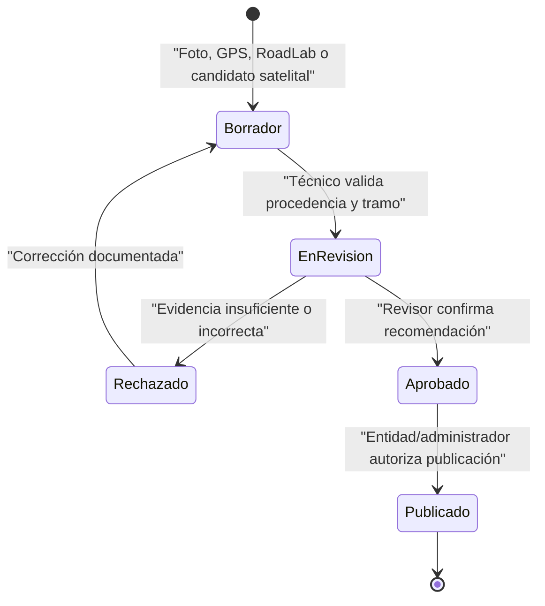
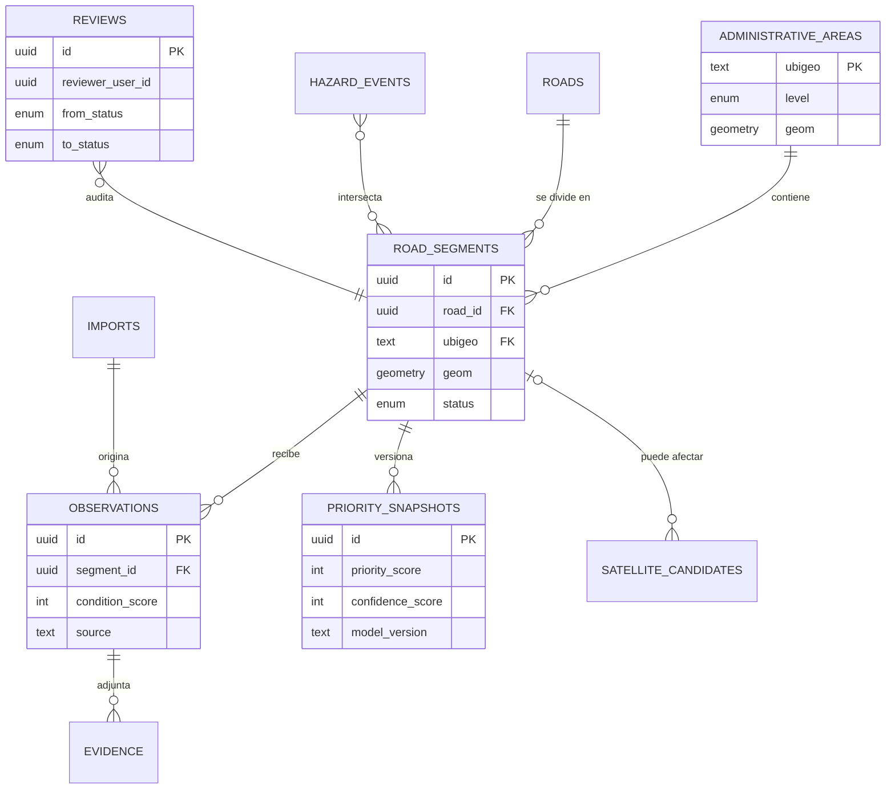
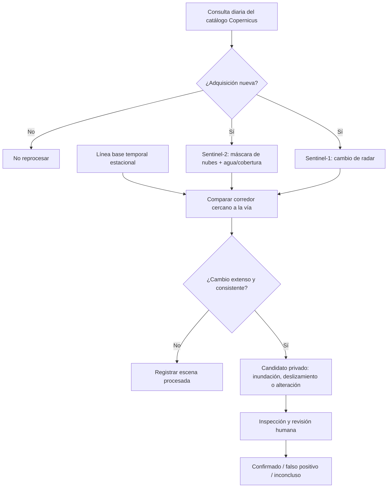
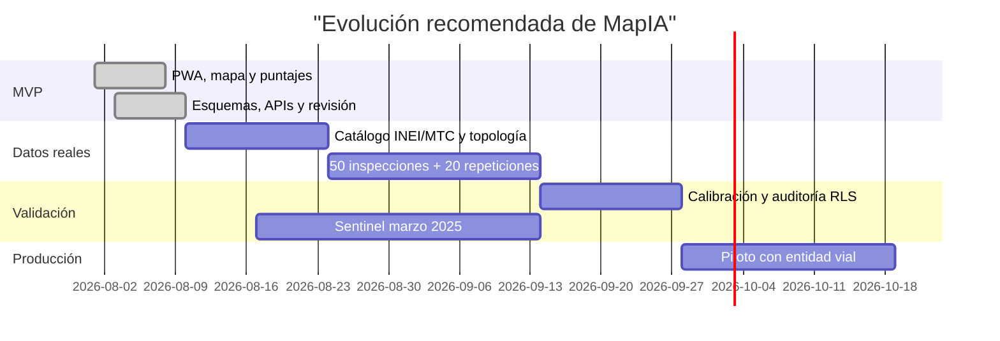

# 🛣️ Plan de implementación de MapIA

## 🎯 Objetivo, alcance y piloto

MapIA convierte datos heterogéneos sobre vías en **recomendaciones explicables por tramo**. Sirve a cualquier distrito del Perú y comienza con Víctor Larco Herrera (`UBIGEO 130111`). Incluye mapa público, captura móvil, panel técnico, importación RoadLab, priorización versionada y candidatos satelitales experimentales.

El alcance termina en la recomendación y la trazabilidad. La aprobación de estudios, presupuesto, diseño, cambio de trazo y obra corresponde a profesionales habilitados y entidades competentes.

## 👥 Responsabilidades

| Actor | Responsabilidad | No puede hacer por sí solo |
|---|---|---|
| 🤖 Algoritmo | Segmentar, combinar criterios, calcular prioridad/confianza y sugerir una intervención | Aprobar una obra o publicar evidencia privada |
| 🧑‍🔧 Técnico | Inspeccionar, corregir vínculo/condición, adjuntar evidencia y enviar a revisión | Autorizar inversión o nuevo trazo |
| 🧑‍⚖️ Revisor | Evaluar procedencia, contradicciones y recomendación; aprobar o rechazar | Sustituir estudios de ingeniería |
| 🏛️ Entidad vial | Determinar competencia, programar estudios/inversión y autorizar intervención | Omitir normativa, seguridad o participación aplicable |

Clasificación inicial de competencia: MTC/Provías para la red nacional, gobierno regional para la red departamental, municipalidad provincial para red vecinal/provincial y municipalidad distrital para vías urbanas locales, siempre validada con el inventario oficial.

## 🔄 Flujo de observación a publicación



Cada transición crea una fila en `reviews` con actor, fecha, estado anterior/nuevo y comentario. El puntaje usado queda congelado en `priority_snapshots` con versión del modelo.

## 🧮 Prioridad y confianza

Los componentes se normalizan entre 0 y 100. Un valor mayor significa mayor necesidad o impacto.

### Prioridad urbana

```text
Pᵤ = 0.55 × condición + 0.25 × conectividad + 0.20 × riesgo/interrupción
```

### Prioridad rural

```text
Pᵣ = 0.40 × condición + 0.25 × conectividad + 0.35 × riesgo/interrupción
```

Bandas iniciales para calibración: `0–44 baja`, `45–64 media`, `65–79 alta`, `80–100 crítica`.

### Confianza independiente

```text
C = 0.30 × cobertura + 0.25 × actualidad + 0.25 × calidad + 0.20 × concordancia
```

`<50 baja`, `50–74 media`, `≥75 alta`. Una prioridad alta con confianza baja significa **inspeccionar pronto**, no degradar artificialmente la gravedad. Las fuentes contradictorias reducen concordancia y generan una alerta para el revisor.

## 🛣️ Matriz de intervención

| Intervención sugerida | Indicio técnico inicial | Decisión requerida |
|---|---|---|
| Mantenimiento rutinario | Defectos localizados, drenaje/limpieza o deterioro incipiente | Programación de conservación |
| Mantenimiento periódico | Pérdida funcional moderada y extendida | Evaluación de tratamiento y presupuesto |
| Rehabilitación | Deterioro severo recuperable sin reemplazar toda la estructura | Evaluación estructural y expediente |
| Reconstrucción | Falla generalizada o pérdida sustancial de capacidad | Estudios, diseño y expediente técnico |
| Mejoramiento | Estándar actual insuficiente de superficie, sección, drenaje o seguridad | Formulación de inversión según Invierte.pe |
| Candidato a estudio de nuevo trazo | Riesgo alto + interrupciones recurrentes + mitigación difícil + importancia estratégica | Estudio de alternativas, ambiente, demanda, predios y aprobación de autoridad |

“Nuevo trazo” nunca significa “construir ahora”; es una alerta excepcional para comparar alternativas.

## 📏 Reglas de segmentación

| Tipo | Regla base | Corte adicional |
|---|---|---|
| Calle urbana pavimentada | Cuadra/intersección; máximo aproximado de 200 m | Cambio de condición, superficie, drenaje o autoridad |
| Carretera pavimentada | Secciones de 200 m | Geometría, riesgo, puente o estado diferente |
| Camino no pavimentado | Secciones de 500 m | Cambio de transitabilidad, superficie, pendiente o riesgo |
| Daño/peligro puntual | Punto y un intervalo afectado | Bache, colapso, huaico, puente o bloqueo |

Cada tramo registra `start_reference` y `end_reference`: intersección/hito, progresiva cuando exista, coordenada y sentido. No se cambia el identificador al agregar una observación; un cambio geométrico crea una nueva versión.

## 🗃️ Modelo entidad-relación



## 🛰️ Flujo satelital experimental



Validación piloto: comparar escenas antes/después del 29 de marzo de 2025 en Trujillo y Víctor Larco, definir corredores de 30–50 m, documentar aciertos, falsos positivos, nubes, sombras, agua permanente y cambios agrícolas. No se usan imágenes satelitales para afirmar la presencia de baches.

## 🛡️ Seguridad, trazabilidad y procedencia

- RLS aplica denegación por defecto; público solo lee `status = publicado`.
- Roles internos: `technician`, `reviewer`, `admin`; `public` es acceso anónimo sin fila de rol.
- Storage conserva originales en bucket privado. La publicación crea una copia derivada sin metadatos sensibles y registra su hash.
- `service_role` y credenciales Copernicus existen únicamente en procesos/servidor.
- Importaciones son idempotentes por fuente, versión, identificador y SHA-256.
- Cada dato guarda fuente, licencia, observación, importación y versión.
- No se automatizan endpoints internos de visores públicos; sin API documentada se usa exportación manual autorizada.
- La transición de estado y la versión del modelo son auditables; no se sobrescribe historia.

## ✅ Pruebas y criterios de aceptación

| Criterio | Prueba automatizable | Validación humana |
|---|---|---|
| Selector territorial y piloto `130111` | API/Playwright | Confirmar catálogo INEI completo importado |
| Responsive 360 px y escritorio | Playwright | Legibilidad en equipos reales |
| Ningún borrador público | API + política RLS | Auditoría de Storage/CDN |
| Importación idempotente | SHA-256 + unique constraints | Revisar fuente y licencia |
| Map matching RoadLab | Vitest con vinculado/no vinculado | Inspeccionar tolerancia por tipo de vía |
| Puntajes completos/parciales/contradictorios/desactualizados | Vitest | Taller de calibración |
| Captura offline/sincronización | Playwright + IndexedDB | Prueba con pérdida real de señal |
| 50 tramos y 20 repeticiones | Dataset piloto incluido | Inspecciones reales obligatorias |
| Evento satelital marzo 2025 | Fixture y prueba Python | Matriz de aciertos/falsos positivos |
| Migración desde cero y build | SQL/CI + `pnpm build` | Revisión de seguridad previa a producción |

La versión actual incluye 50 tramos sintéticos reproducibles para probar UX y lógica. **No se considera cumplida la inspección de campo** hasta levantar 50 segmentos reales y repetir 20 con el protocolo acordado.

## 📚 Referencias oficiales

- [IDE INEI: límites, WFS/WMS y descargas GPKG](https://ide.inei.gob.pe/)
- [MTC: Manuales de carreteras](https://portal.mtc.gob.pe/transportes/caminos/normas_carreteras/manuales.html)
- [MTC: Mantenimiento o conservación vial — Parte IV](https://portal.mtc.gob.pe/transportes/caminos/normas_carreteras/documentos/manuales/Conservacion_Vial_Parte_4_Mant_Rutinario_Caminos_Vecinales_GL.pdf)
- [MEF: Invierte.pe](https://www.mef.gob.pe/es/normatividad-inv-publica/archivos-historicos/temas-historico/invierte-pe)
- [Copernicus Data Space Ecosystem](https://dataspace.copernicus.eu/)
- [Documentación de Sentinel-1](https://sentinels.copernicus.eu/web/sentinel/user-guides/sentinel-1-sar)
- [Documentación de Sentinel-2](https://sentinels.copernicus.eu/web/sentinel/user-guides/sentinel-2-msi)
- [Licencia OpenStreetMap](https://www.openstreetmap.org/copyright)

## 🗓️ Fases de entrega


