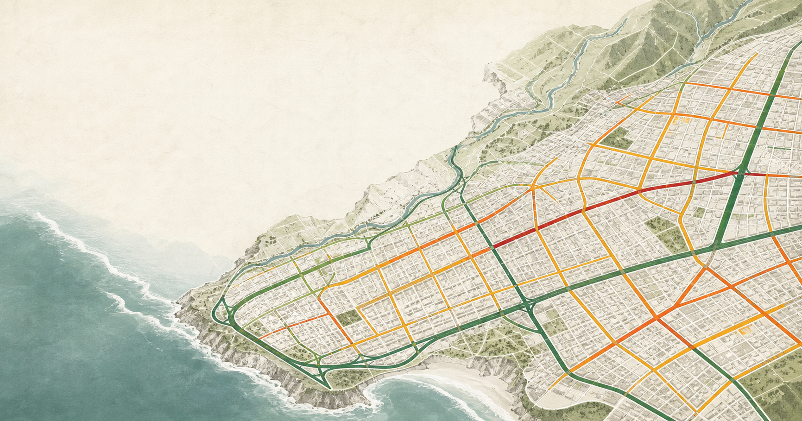
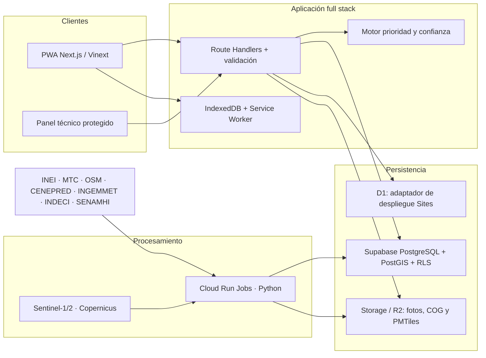

# 🗺️ MapIA

**Priorización vial auditable para el Perú.** MapIA reúne condición de la vía, conectividad, riesgos y evidencia de campo para recomendar qué tramos conviene inspeccionar e intervenir primero. El piloto incluido corresponde a **Víctor Larco Herrera, Trujillo (`UBIGEO 130111`)**.

> ⚠️ MapIA es apoyo a la decisión. No reemplaza inspecciones, expedientes técnicos, estudios de ingeniería ni la autorización de la entidad vial competente. Una vía nueva solo puede aparecer como **“candidata a estudio de nuevo trazo”**.



## 🧭 Qué incluye este repositorio

- 🌐 Mapa público MapLibre responsive con 50 tramos piloto ajustados a ejes reales de OpenStreetMap, filtros, prioridad, confianza e intervención sugerida.
- 📱 PWA instalable y captura de foto/comentario con cola offline en IndexedDB.
- 🔐 Panel técnico protegido, importación CSV RoadLab, bandeja de revisión y registro de transiciones.
- 🧮 Motor de prioridad urbana/rural y confianza independiente, cubierto por pruebas unitarias.
- 🗃️ Dos adaptadores reproducibles: Supabase/PostGIS para la arquitectura geoespacial objetivo y D1/R2 para despliegue inmediato en Sites.
- 🛰️ Proceso Python experimental para candidatos Sentinel-1/2, con fixture del evento del 29 de marzo de 2025.
- 📤 APIs de consulta, detalle, observaciones, revisión y exportación CSV/GeoJSON.

### Capturas previstas

| Vista | Qué debe comprobarse |
|---|---|
| 🖥️ Mapa de escritorio | Filtros laterales, mapa, leyenda y explicación del tramo |
| 📱 Móvil de 360 px | Mapa a pantalla completa, panel inferior y filtros desplegables |
| 🧑‍🔧 Panel técnico | Cola de revisión, importación RoadLab y candidato satelital privado |
| 📷 Captura | Foto, GPS, comentario y aviso de sincronización offline |

## ✨ Funcionalidades

### Público

- Selector `departamento → provincia → distrito`, iniciado en `130111`.
- Tramos **exclusivamente publicados** con prioridad, confianza, fecha, fuente y autoridad responsable.
- Filtros por prioridad, confianza, superficie e intervención.
- Descarga GeoJSON por tramo y CSV del piloto.
- Visualización mobile-first sin perder el detalle ni los filtros.

### Técnicas

- Flujo `borrador → en revisión → aprobado/rechazado → publicado`.
- Fotografías originales privadas; solo una copia aprobada puede publicarse.
- Importación RoadLab validada, idempotente por SHA-256 y con map matching; las filas lejanas quedan `unmatched`.
- Historial de prioridad versionado y revisiones inmutables.
- Candidatos satelitales siempre privados hasta revisión humana.

## 🧱 Arquitectura



La aplicación usa una interfaz de datos estable. Para análisis geoespacial nacional, MVT y RLS, la opción objetivo es **Supabase/PostGIS**. El starter de Sites también incluye un esquema equivalente para **D1/R2**, útil para una demo académica de bajo costo.

## 🚀 Instalación local con pnpm

Requisitos: Node.js `>=22.13`, pnpm `11` y Python `>=3.11` para los procesos de datos.

```bash
pnpm install
cp .env.example .env.local
pnpm db:migrate:local
pnpm dev
```

Abre `http://localhost:3000`. El piloto funciona sin credenciales externas. Sus **geometrías son ejes viales reales derivados de OpenStreetMap**; sus puntajes de condición, riesgo y conectividad continúan siendo demostrativos hasta completar la inspección de campo.

### Variables de entorno

| Variable | Uso | Exposición |
|---|---|---|
| `NEXT_PUBLIC_APP_URL` | URL canónica de la PWA | Pública |
| `NEXT_PUBLIC_PMTILES_URL` | Base cartográfica PMTiles en R2 | Pública |
| `SUPABASE_URL` | Proyecto PostGIS | Solo servidor en procesos |
| `SUPABASE_SERVICE_ROLE_KEY` | Importaciones administrativas | **Secreto, nunca en navegador** |
| `COPERNICUS_CLIENT_ID/SECRET` | Descarga de escenas nuevas | Secreto de Cloud Run |

Bindings del despliegue Sites: `DB` (D1) y `EVIDENCE` (R2), declarados en `.openai/hosting.json`.

### Base de datos

```bash
# D1 local
pnpm db:migrate:local

# Generar migraciones Drizzle después de cambiar db/schema.ts
pnpm db:generate

# Supabase local/CI, con Supabase CLI instalado
supabase db reset
```

- Esquema D1: [`db/schema.ts`](db/schema.ts) y [`drizzle/0000_mapia.sql`](drizzle/0000_mapia.sql).
- Esquema PostGIS/RLS: [`supabase/migrations/202608030001_mapia.sql`](supabase/migrations/202608030001_mapia.sql).
- Datos demo: [`lib/demo-data.ts`](lib/demo-data.ts) y [`supabase/seed.sql`](supabase/seed.sql).

## 🧪 Pruebas

```bash
pnpm lint
pnpm test                 # Vitest: puntajes y RoadLab
pnpm test:integration     # verificación del código renderizable
pnpm exec playwright install chromium
pnpm test:e2e             # escritorio + viewport de 360 px + privacidad pública
pnpm build
```

Los casos unitarios cubren pesos urbanos/rurales, valores parciales, datos contradictorios o débiles, confianza, umbrales y la regla estricta para un nuevo trazo. La calibración de campo de **50 segmentos y 20 repeticiones** se mantiene como criterio operativo: necesita inspecciones reales y no se declara completada con datos sintéticos.

## 📡 Fuentes, atribución y límites

| Fuente | Uso previsto | Condición |
|---|---|---|
| [IDE INEI](https://ide.inei.gob.pe/) | Límites, UBIGEO, WFS/WMS y GPKG | Conservar metadatos; límites censales pueden ser referenciales |
| [Manuales de carreteras MTC](https://portal.mtc.gob.pe/transportes/caminos/normas_carreteras/manuales.html) | Inventario, conservación, drenaje y seguridad | Aplicar versión vigente y criterio profesional |
| [OpenStreetMap](https://www.openstreetmap.org/copyright) | Geometría map-matched del piloto y topología complementaria | Atribución ODbL; no sustituye inventario oficial |
| [CENEPRED](https://sigrid.cenepred.gob.pe/sigridv3/) / [INGEMMET](https://geocatmin.ingemmet.gob.pe/geocatmin/) | Peligros y susceptibilidad | Importación autorizada o descarga manual documentada |
| [INDECI](https://portal.indeci.gob.pe/) / [SENAMHI](https://www.senamhi.gob.pe/) | Emergencias e hidrometeorología | Verificar fecha, escala y licencia por conjunto |
| [Copernicus Data Space](https://dataspace.copernicus.eu/) | Sentinel-1/2 | Nubes, resolución y recurrencia limitan la interpretación |

No se consumen endpoints internos o no documentados de visores. Cada registro guarda fuente, licencia, fecha de observación, fecha de importación, versión y hash cuando corresponde. El satélite sirve para inundaciones, deslizamientos o cambios extensos; **no detecta baches de forma confiable**.

## ☁️ Despliegue

### Opción geoespacial objetivo

1. Crear el proyecto Supabase y aplicar la migración PostGIS/RLS.
2. Crear buckets privados para originales y públicos solo para derivados aprobados.
3. Publicar PMTiles/COG en Cloudflare R2 con CORS limitado al dominio de MapIA.
4. Desplegar Next.js en Vercel y configurar únicamente claves públicas en el cliente.
5. Programar los procesos de `pipelines/` en Cloud Run Jobs; el job consulta solo adquisiciones Sentinel nuevas.

### Opción demo incluida

El repositorio está preparado para Sites mediante Vinext, D1 y R2:

```bash
pnpm build
```

Para Vercel, `vercel.json` selecciona automáticamente la compilación estándar de Next.js mediante `pnpm run build:vercel`. El adaptador D1/R2 queda desactivado en ese entorno; configure Supabase para la persistencia de producción.

## 🔐 Roles, privacidad y publicación

| Rol | Puede hacer |
|---|---|
| `public` | Leer áreas, vías y evidencia **publicadas** |
| `technician` | Crear/editar borradores, importar y enviar a revisión |
| `reviewer` | Aprobar o rechazar con comentario auditable |
| `admin` | Gestionar roles, fuentes y publicación final |

La capa pública filtra `status = publicado`. Un cambio de estado inválido devuelve conflicto; una fotografía original no se sirve mediante URL pública. Las políticas completas están en la migración RLS.

## 🗂️ Estructura

```text
app/                 PWA, panel técnico y APIs
db/ + drizzle/       Esquema D1 reproducible
lib/                 Puntajes, datos demo y RoadLab
pipelines/           Importadores y experimento Sentinel
supabase/             PostGIS, RLS y seed
tests/                Vitest, integración y Playwright
PLAN_IMPLEMENTACION.md Decisiones, flujo y criterios de aceptación
```

Consulta [`PLAN_IMPLEMENTACION.md`](PLAN_IMPLEMENTACION.md) para el modelo de decisión completo, responsabilidades y diagramas.
